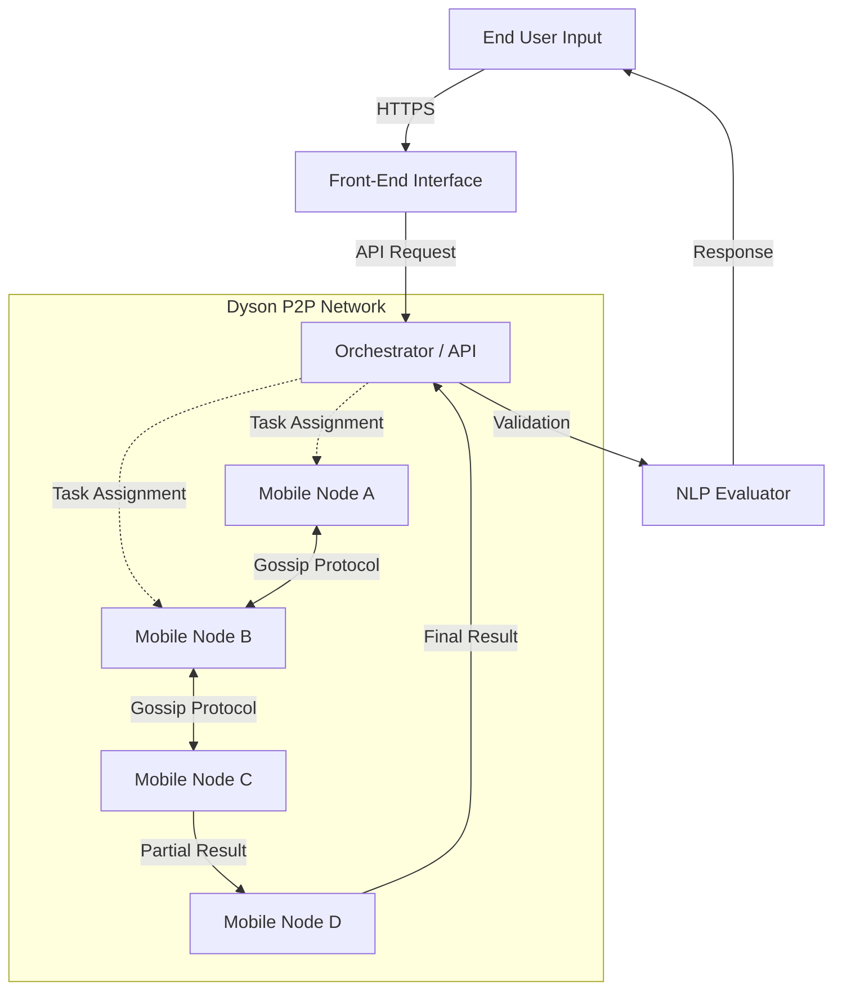
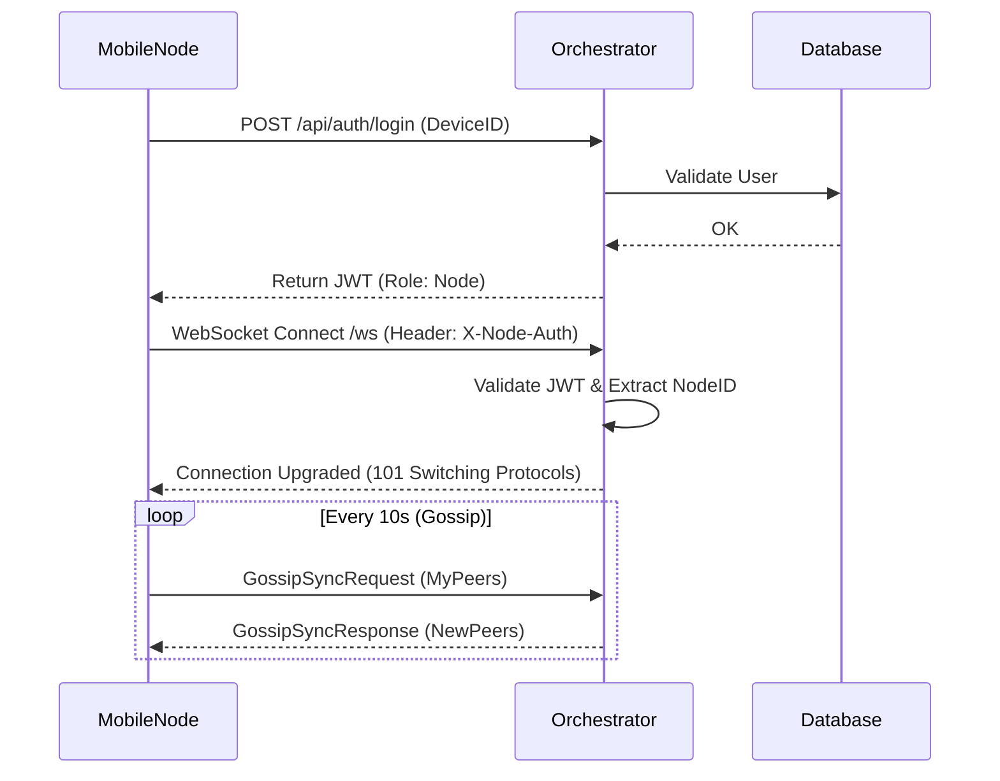
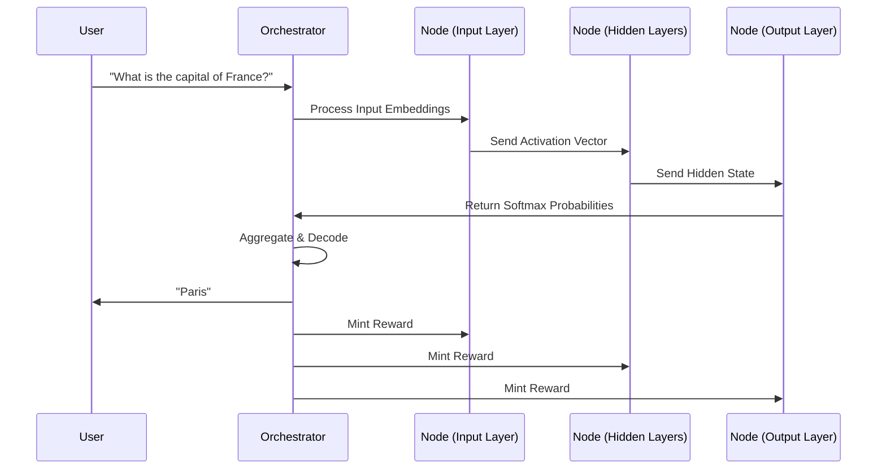

# Dyson Project (Galileu) - Technical Whitepaper & Documentation

> **Version**: 1.0.0
> **Date**: 2025-12-20
> **Classification**: Technical Specification & Educational Guide

---

## 📖 Executive Summary

**Dyson** (internal codename *Galileu*) is a pioneering distributed Artificial Intelligence ecosystem designed to decentralize the cognitive processing of Large Language Models (LLMs) and Neural Networks. By leveraging a Peer-to-Peer (P2P) architecture, Dyson fragments the execution of AI models across a vast network of nodes—primarily mobile devices—creating a "Global Distributed Brain".

This document serves as a comprehensive guide for engineers, stakeholders, and enthusiasts, detailing the architectural decisions, the cryptographic incentive protocols, and the novel "Split Inference" logic that powers the network.

---

## 📑 Table of Contents

1.  [Vision and Introduction](#vision-and-introduction)
2.  [System Architecture Overview](#system-architecture-overview)
3.  [The Core Components](#the-core-components)
    *   [3.1 The Orchestrator (Backend)](#31-the-orchestrator-backend)
    *   [3.2 The Mobile Node (App)](#32-the-mobile-node-app)
    *   [3.3 The Brain (AI Engine)](#33-the-brain-ai-engine)
4.  [Communication Protocols](#communication-protocols)
    *   [4.1 GOSP (Gossip Protocol)](#41-gosp-gossip-protocol)
    *   [4.2 WebSocket Handshake & Auth](#42-websocket-handshake--auth)
5.  [Tokenomics & Incentives](#tokenomics--incentives)
6.  [Workflow Diagrams](#workflow-diagrams)
7.  [Use Cases](#use-cases)
8.  [Presentation Slides](#presentation-slides)

---

## 1. Vision and Introduction

### The Problem: Centralized AI
Contemporary Artificial Intelligence is heavily centralized. Training and running large models require massive data centers with thousands of GPUs, leading to:
*   **High Costs**: Prohibitive for small players.
*   **Single Points of Failure**: Centralized infrastructure is vulnerable to outages and censorship.
*   **Energy Inefficiency**: Massive localized heat generation and energy consumption.
*   **Data Privacy Risks**: User data must be sent to a central server.

### The Solution: Dyson (Galileu)
Dyson proposes a paradigm shift: **Decentralized Cognitive Processing**. Instead of one giant server, Dyson uses millions of smartphones, each acting as a neuron or a small cluster of neurons.
*   **Distributed Inference**: The model is split into segments. Node A runs Layer 1-5, Node B runs Layer 6-10.
*   **Scalability**: The network grows stronger as more users join.
*   **Incentivized**: Users earn **GLU Tokens** for contributing idle CP/NPU power.

---

## 2. System Architecture Overview

The Dyson architecture is a **Hybrid P2P System**. It features a lightweight central coordination layer (Orchestrator) for bootstrapping and task assignment, and a robust P2P layer for node-to-node data transfer and state synchronization.

### High-Level Topology

---

## 3. The Core Components

### 3.1 The Orchestrator (Backend)
Located in the `Api` directory, the Orchestrator is the administrative heart of the network.

*   **Technology Stack**: .NET 8, ASP.NET Core Web API.
*   **Key Responsibilities**:
    *   **Node Registration**: Tracks active nodes via `NodeRegistryService`.
    *   **Authentication**: Uses JWT (JSON Web Tokens) to secure communication via `JwtValidatorService`.
        *   Security Header: `X-Node-Auth` for nodes, `X-User-Auth` for users.
    *   **Gossip Seed**: Acts as the initial "Bootstrap Node" that new peers connect to.
    *   **Token Management**: Manages the `WalletService` and `RewardContractService` (Mint/Burn logic).
*   **Database**: Uses MongoDB (via `Repositorio<T>`) to store User Sessions, Wallets, and Transactions.

### 3.2 The Mobile Node (App)
Located in the `App/App` directory, this is the client software running on user devices.

*   **Technology Stack**: .NET MAUI (Multi-platform App UI). Runs on Android, iOS, Windows, macOS.
*   **Key Responsibilities**:
    *   **Resource Management**: Monitors Battery, Temperature (`Cpu`, `Gpu` namespaces).
    *   **AI Execution**: Hosts the `GenerativeNeuralNetworkLSTM`.
    *   **P2P Networking**: Implements the `NodeClient` to form WebSocket connections with peers.
*   **Isolation**: The execution happens in a sandboxed environment to prevent access to user's private data (Photos, Contacts).

### 3.3 The Brain (AI Engine)
Located in `App/App/Brain`, the core intelligence is a custom implementation.

*   **Model Type**: LSTM (Long Short-Term Memory) Neural Network, optimized for sequential data (text).
*   **Training Strategy (Student-Teacher)**:
    *   The `TeacherModelService` generates synthetic "Golden Data" using advanced models (like Google Gemini 1.5/2.5).
    *   **Synthetic Dataset**: "Question/Answer" pairs generated dynamically to train the local LSTM.
    *   This allows the small mobile model to distill knowledge from a larger model ("Distillation").
*   **Memory Efficiency**:
    *   **TensorPool**: Custom memory management to avoid GC pressure.
    *   **Swap Files**: Large tensors are swapped to disk to keep RAM usage low on mobile devices.
    *   **Sanity Checks**: Built-in verification (`RunSanityCheckZeroRAM`) ensures logical consistency of gradiants before participating in the network.

---

## 4. Communication Protocols

### 4.1 GOSP (Gossip Protocol)
The **GOSP** (Galileu Gossip Protocol) is the mechanism for state synchronization. It is inspired by epidemic algorithms where information spreads like a virus.

*   **Implementation**: `GossipService.cs`.
*   **Frequency**: Every ~10 seconds.
*   **Mechanism**:
    1.  Node selects a random peer from `KnownPeers`.
    2.  Sends `GossipSyncRequest` containing its own list of known peers.
    3.  Receiver merges the list and responds.
    4.  Result: The network topology map propagates eventually to all nodes without a central directory.

### 4.2 WebSocket Handshake & Auth
Communication happens over persistent WebSockets to minimize latency.

1.  **Connection**: Node connects to `/ws`.
2.  **Headers**: Must include `X-Node-Auth` with a valid JWT signed by the Orchestrator.
3.  **Role Check**: The JWT must contain the claim `role: node`.
4.  **Handshake**: Server verifies signature -> Upgrades connection -> Adds node to `ChatService` (Distribution bus).

---

## 5. Tokenomics & Incentives

The Dyson economy is fueled by the **GLU (Galileu) Token**.

### Structure
*   **System Mint**: `SYSTEM_MINT` address. Source of all new tokens.
*   **System Burn**: `SYSTEM_BURN` address. Destination for fees or penalties.

### Reward Loop
1.  **Contribution**: A node performs an inference task (calculates a partial vector).
2.  **Verification**: The result is validated (e.g., via redundancy or NLP consistency check).
3.  **Scoring**: The node receives a `contributionScore`.
4.  **Minting**: `RewardContractService` calculates `Score * 10` GLU and mints it to the User's Wallet.

> **Note**: The token allows for "Passive Income" by simply keeping the app open and connected to WiFi.

---

## 6. Workflow Diagrams

### New Node Entry Process

### Distributed Inference Flow (Conceptual)

---

## 7. Use Cases

### 🌟 1. Decentralized Personal Assistant
A privacy-focused alternative to Siri or Alexa. The voice data is processed by a swarm of local neighbor nodes. No single company owns the audio recording because it is sharded instantly.

### 🧪 2. Collaborative Scientific Research
Researchers can upload massive datasets (e.g., protein folding simulations). The Dyson network splits the dataset into micro-chunks. Thousands of phones process these chunks overnight while charging.

### 📱 3. Edge-Computing for IoT
Smart cities with thousands of sensors (cameras, traffic lights) can use Dyson nodes (passing cars, pedestrians' phones) to process video feeds locally for anomaly detection without sending heavy video streams to the cloud.

---

## 8. Presentation Slides

The following outline can be used to generate a pitch deck or presentation.

| Slide Title | Key Bullet Points | Visual Idea |
| :--- | :--- | :--- |
| **Slide 1: Title** | • Project: Dyson (Galileu) • The Future of Decentralized AI • Presented by: Engineering Team | Logo of a connected brain mesh. |
| **Slide 2: The Problem** | • Centralized AI is expensive. • Data privacy is non-existent. • Single point of failure. | Image of a burning server room vs. a serene network. |
| **Slide 3: The Solution** | • Utilize 3.8 Billion active smartphones. • Split the brain, share the load. • Rewarded participation. | Diagram of phones forming a giant supercomputer. |
| **Slide 4: Technology** | • .NET 8 & MAUI Cross-Platform. • Akka.NET Actor Model. • Custom Tensor Core (LSTM). | Tech stack logos (C#, .NET, Mongo). |
| **Slide 5: Tokenomics** | • Earn GLU for compute. • Fair distribution based on work. • Sustainable economy. | Coin icon with an ascending graph. |
| **Slide 6: Roadmap** | • Q1: Beta Swarm Launch. • Q2: Transformer Model Support. • Q3: Public Mainnet. | Timeline graphic. |

---

## 9. Conclusion

The Dyson project represents a significant leap forward in democratizing Artificial Intelligence. By effectively utilizing the dormant computing power of billions of mobile devices, we can build a **Supercomputer of the People**.

The modular architecture, robust P2P syncing via GOSP, and the fair incentive model create a self-sustaining ecosystem that scales linearly with adoption. Dyson is not just an app; it is the infrastructure for the next generation of privacy-preserving, distributed intelligence.

---
*End of Document*
